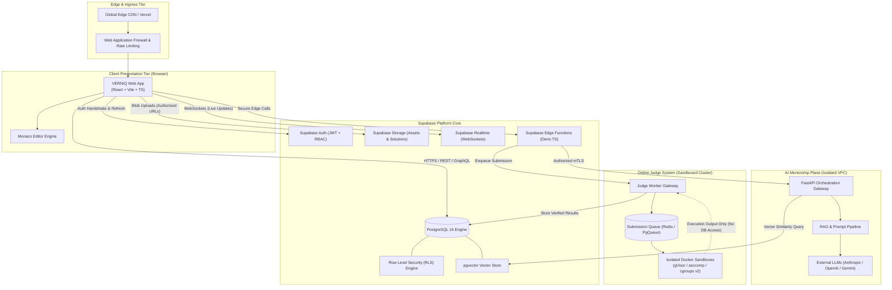
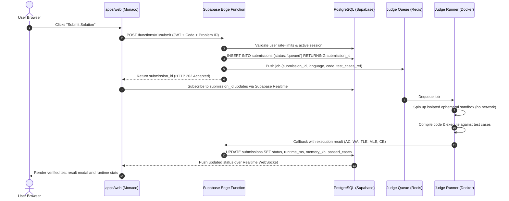
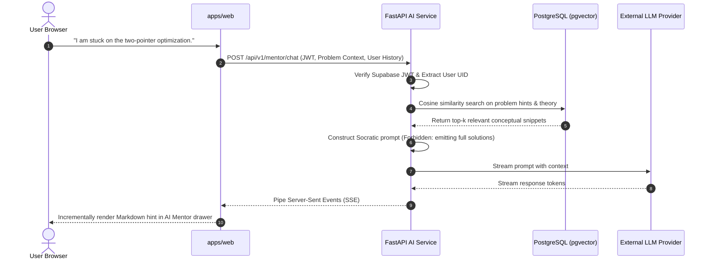

# VERNIQ System Architecture

> **Document Version:** 1.0.0  
> **Status:** Approved Architecture Baseline  
> **Author:** VERNIQ Lead System Architecture Team  
> **Scope:** Phase 0 Product Foundation  

---

## 1. Executive Summary

VERNIQ is an enterprise-grade engineering learning and career acceleration platform. The platform is architected to support complex educational workflows—spanning curriculum roadmaps, algorithmic coding practice with an isolated judge, interactive system design, AI-driven contextual mentoring, and verifiable placement preparation—while strictly upholding security, scalability, and performance standards.

The architecture enforces strict segregation of concerns:
- **Presentation Layer:** High-performance, client-side rendered Single Page Application (SPA) leveraging React, TypeScript, Vite, and Tailwind CSS.
- **Data & Core State Plane:** Managed PostgreSQL via Supabase, with comprehensive Row Level Security (RLS), Supabase Auth, Storage, Realtime, and Edge Functions.
- **Intelligent Knowledge Plane (AI Service):** Standalone FastAPI microservice providing streaming LLM orchestration, semantic vector retrieval (pgvector/RAG), and code review pipelines.
- **Untrusted Execution Plane (Online Judge):** Fully decoupled, sandboxed container runtime isolated from all production databases and internal service networks.

---

## 2. High-Level Topology

---

## 3. Major Architectural Modules

### 3.1 Client Tier (`apps/web`)
- **Technology Stack:** React 19, TypeScript (strict), Vite, Tailwind CSS (semantic design tokens), React Router v7, Recharts, and Monaco Editor.
- **Role:** High-speed, responsive, accessible interface. It maintains zero business-critical secrets, enforces optimistic UI updates, and speaks directly to Supabase via the official TypeScript client using anonymous public keys authenticated by JSON Web Tokens (JWT).
- **Security Boundary:** Untrusted environment. All inputs, permissions, and session tokens are strictly validated server-side.

### 3.2 Backend Platform (Supabase & PostgreSQL)
- **Role:** System of record for users, curriculum, roadmap dependencies, problem definitions, test suite metadata, submissions, revision states, and community interactions.
- **Components:**
  - **Supabase Auth:** Email/password, OAuth (GitHub, Google), Magic Links, Session Management, and Role-Based Access Control (RBAC).
  - **PostgreSQL 16:** Relational database with strict normalized schemas, constraints, foreign keys, and indexes.
  - **Row Level Security (RLS):** All tables have default-deny RLS enabled. Data access is governed strictly by the executing user's authenticated UID and claims.
  - **pgvector:** Native vector similarity indexing for curriculum embeddings, problem semantic search, and AI context retrieval.
  - **Supabase Storage:** S3-compatible object store for user avatars, problem illustrations, code snapshots, and course assets with bucket-level security policies.
  - **Supabase Realtime:** Low-latency WebSockets for live contest leaderboards, collaborative coding, and submission execution status updates.
  - **Edge Functions:** Serverless TypeScript functions running on Deno for webhook processing, Stripe billing webhooks, and administrative operations requiring service-role elevation.

### 3.3 AI Mentorship & Code Intelligence (`services/ai`)
- **Technology Stack:** Python 3.11+, FastAPI, Uvicorn, LangChain / LlamaIndex, Pydantic v2.
- **Role:** Provides contextual AI assistance without hallucinating or leaking solution code. Powering:
  - Socratic AI Mentor (guided hints rather than direct code answers).
  - AI Code Reviewer (static analysis, algorithmic complexity estimation, clean code critique).
  - AI Mock Interviewer (interactive behavioral and technical dialogue).
- **Communication Pattern:**
  - The client interacts with the AI service through Supabase Edge Functions or an authenticated reverse proxy that verifies the user's Supabase JWT.
  - The AI service queries PostgreSQL via `pgvector` for curated curriculum chunks and problem statements (Retrieval-Augmented Generation).
  - Streaming responses (Server-Sent Events / SSE) are piped back to the client for real-time token rendering.

### 3.4 Online Code Judge (`services/judge`)
- **Technology Stack:** Go / Node.js worker daemon, Redis queue, Docker sandbox runtime with `gVisor` / `nsjail` container isolation.
- **Role:** Compile, execute, and evaluate untrusted user-submitted source code in C++, Java, Python, Go, Rust, and JavaScript against hidden test suites.
- **Crucial Security Mandate:** **Arbitrary user code must NEVER execute in the web application runtime, database server, or any environment holding access tokens or network access.**
- **Isolation Guarantees:**
  - Network egress disabled (`--network none`).
  - CPU quotas (`cgroups` limiting core usage).
  - Memory caps (strict address space limits).
  - Wall-clock and CPU time limit enforcement (e.g. 1.0–2.0 seconds).
  - File system isolation (read-only root filesystem with ephemeral, in-memory `tmpfs` mounts).
  - Syscall filtering via `seccomp` profiles and `gVisor` kernel virtualization.

---

## 4. End-to-End Data Flows

### 4.1 Authenticated Practice & Submission Flow

### 4.2 Socratic AI Mentorship Flow (RAG)

---

## 5. Security Boundaries and Principles

1. **Zero Client Trust:** The client application is considered compromised by definition. All authorizations, data mutations, and quota deductions are checked by PostgreSQL RLS or authenticated Edge Functions.
2. **Key Separation:**
   - `VITE_SUPABASE_ANON_KEY`: Safe for public browser distribution. Strictly subject to RLS policies.
   - `SUPABASE_SERVICE_ROLE_KEY`: Strictly restricted to backend Edge Functions and secure CI/CD jobs. **Never** included in client-side bundles or frontend environment variables.
3. **Execution Isolation:** Untrusted code execution is walled behind air-gapped sandboxes without disk persistence, network capability, or privilege escalation routes.
4. **Defense in Depth:**
   - Web Application Firewall (WAF) rate limits public endpoints.
   - Input sanitization (XSS prevention) on all rich-text and Markdown preview renders.
   - Prepared statements and parameterized queries default to prevent SQL injection.
   - CORS policies strictly whitelisting verified production domains.

---

## 6. Scalability & Operational Strategy

| Tier | Current Strategy (Phase 0 Baseline) | Scale Path (100k+ MAU) |
|---|---|---|
| **Frontend** | Static asset hosting on Edge CDN (Vercel/Cloudflare) | Multi-region global caching with stale-while-revalidate |
| **Database** | Supabase managed PostgreSQL with pooling (Supavisor) | Read replicas for analytics, table partitioning by submission date |
| **Realtime** | Supabase Realtime broadcast channels | Dedicated cluster for contest leaderboards and cluster sharding |
| **AI Service** | Single-region FastAPI instance with async workers | Horizontal auto-scaling container groups behind AWS/GCP ALB |
| **Code Judge** | Single worker instance with local Docker daemon | Auto-scaling Kubernetes/Nomad cluster running gVisor nodes |
| **Object Storage** | Supabase Storage (S3-compatible) | Multi-region CDN distribution with signed pre-generated URLs |
